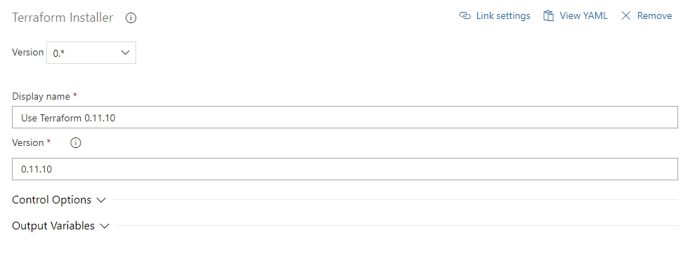

# Terraform Tasks for Azure DevOps

The tasks in this extension allow for running terraform cli commands from both the Build and Release pipelines in Azure DevOps.

# Installing Terraform

Installs a specific version of terraform on the build agent. This only needs to be run once at the start of the pipeline. 

**Please note that hosted Ubuntu build agents come with terraform installed.

## Version
Input the version of terraform to install on the agent. The version must be a valid terraform version. If empty the version defaults to **0.11.8**.

# Executing Terraform Commands

## Supported Commands
The Terraform CLI task supports executing the following commands
- verison
- init
- validate
- plan
- apply

## Contextual Task Configuration
The task definition will adjust to the selected command to prompt for what is relevant to the command. For example, `validate` does not require knowledge of the backend configuration so this section will not be used when executing `validate`. The `validate` command does accept vars file however. Therefore, the field to specify vars file will be available.

## Deployment Target Environment
When executing `plan` or `apply` commands, the task will prompt for the target azure subscription to use. This is specified as a service connection/principal for deploying azure resources.

## Backend State Support
The task currently supports two backend configurations
- local (default for terraform) - State is stored on the agent file system.
- azurerm - State is stored in a blob container within a specified Azure Storage Account.

The backend configuration will be prompted when relevant for the selected command. If azurerm selected, the task will prompt for a service connection and storage account details to use for the backend.

